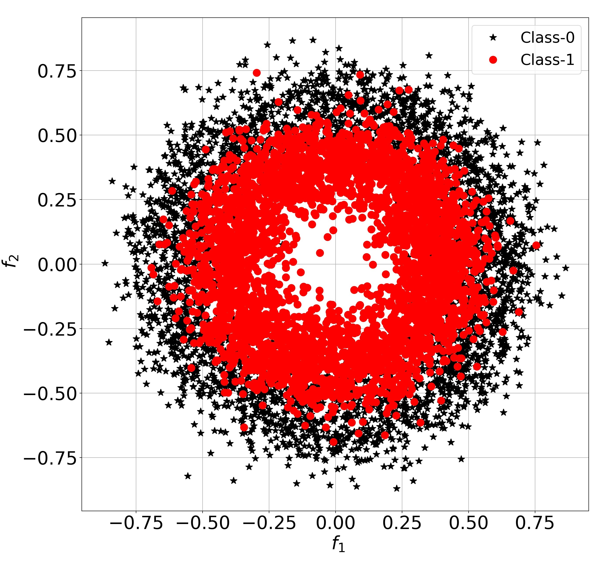

# Neurochaos-SVM based classification of synthetically generated overlapping concentric circle data.


## ChaosFEX - Feature Extraction using Chaos

### Neurochaos - SVM

[Video explanation on YouTube](https://www.youtube.com/watch?v=8JQstLi4COk) on the usage of chaotic maps as kernels and highlighting chief ideas and inspiration.

Reference Paper:

1) Harikrishnan NB and Nithin Nagaraj, "Neurochaos Inspired Hybrid Machine Learning Architecture for Classification", IEEE International Conference on Signal Processing and Communication (SPCOM 2020), IISc. Bengaluru (Virutal Conference), July 20-23, 2020. (ORAL-HKNB).  (Github link to the code https://github.com/pranaysy/ChaosFEX- courtesy - [Dr. Pranay Yadav](https://github.com/pranaysy) and Harikrishnan N B). 

2) Harikrishnan Nellippallil Balakrishnan, Aditi Kathpalia, Snehanshu Saha, Nithin Nagaraj, "ChaosNet: A chaos based artificial neural network architecture for classification", Chaos: An  Interdisciplinary  Journal  of  Non-linear  Science, Vol. 29, No. 11, pp. 113125-1 -- 113125-17 (2019); https://doi.org/10.1063/1.5120831.

### Dependencies

1. ``` Python 3```

2. ```Numpy```

3. ```Numba```

4. ```Matplotlib```

### Installation

1. git-clone into a working directory.

### Goal is to classify the following overlapping concentric circle data.


### How to run

1. full_test_data_neurochaos.py: Code for the classfication of test data using ChaosFEX.
2. full_test_data_svm_rbf.py: Code for the classfication of test data using SVM with RBF kernel.
3. main_low_training_sample_regime.py: Code for the classification of test data using Neurochaos-SVM and SVM with RBF kernel in the low trainng sample regime.
4. load_data_synthetic.py: Code to load the normalized train and test data.
5. quad_data_picking.py: Support files required to run the main codes.
6. plot_low_training_sample_regime.py: Code to plot the results corresponding to the low training sample regime (main_low_training_sample_regime.py).
7. plot_features.py: Code to plot the chaotic feature space (firing time, firing rate, energy, entropy)
8. hyperparameter_tuning_neurochaos.py: File to find the Optimum Hyperparameters for ChaosFEX.
9. plot_hyperparamter_tuning_ChaosFEX.py: Code to plot the results corresponding to the hyperparameter tuning (hyperparameter_tuning_neurochaos.py).
10. Codes corresponding to noise experiments: (a) occd_train_ccd_test_chaosfex.py (Train with OCCD and test with CCD using ChaosFEX), (b) ccd_train_ccd_test_chaosfex.py (Train with CCD and test with CCD using ChaosFEX), (c) svm_occd_train_ccd_test.py (Train with OCCD and test with CCD using SVM RBF kernel), (d) svm_ccd_train_ccd_test.py (Train with CCD and test with CCD using SVM RBF kernel).
11. svm_hyperparametertuning.py: Hyperparameter tuning code for SVM.

### Licence

Copyright 2020 [Harikrishnan N. B.](https://github.com/HarikrishnanNB), [Pranay Yadav](https://github.com/pranaysy), and [Nithin Nagaraj](https://sites.google.com/site/nithinnagaraj2/)

Licensed under the Apache License, Version 2.0 (the "License"); you may not use this file except in compliance with the License. You may obtain a copy of the License at
```
   http://www.apache.org/licenses/LICENSE-2.0
```
Unless required by applicable law or agreed to in writing, software distributed under the License is distributed on an "AS IS" BASIS, WITHOUT WARRANTIES OR CONDITIONS OF ANY KIND, either express or implied. See the License for the specific language governing permissions and limitations under the License.

